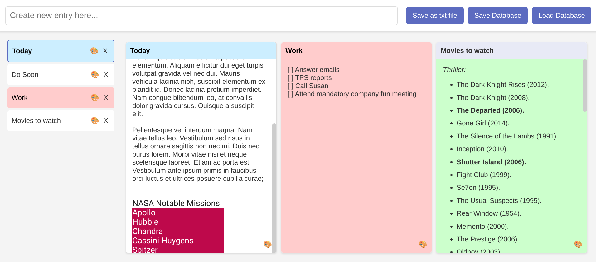
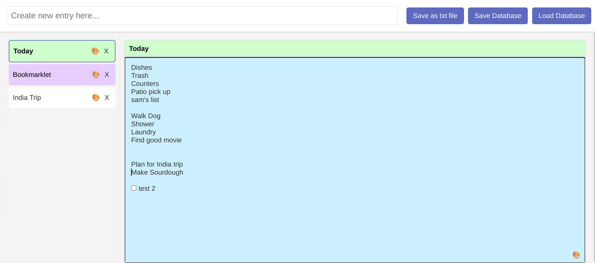
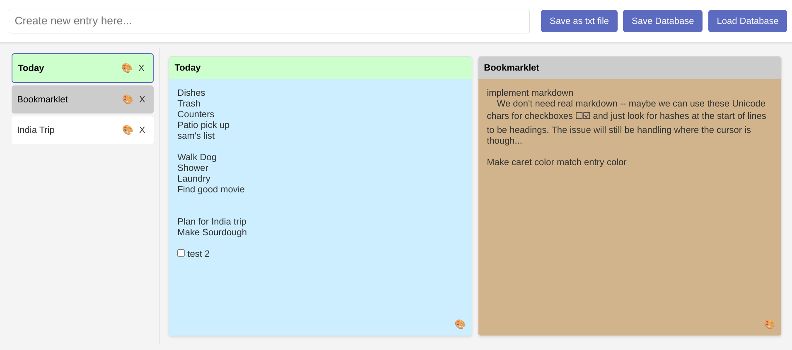
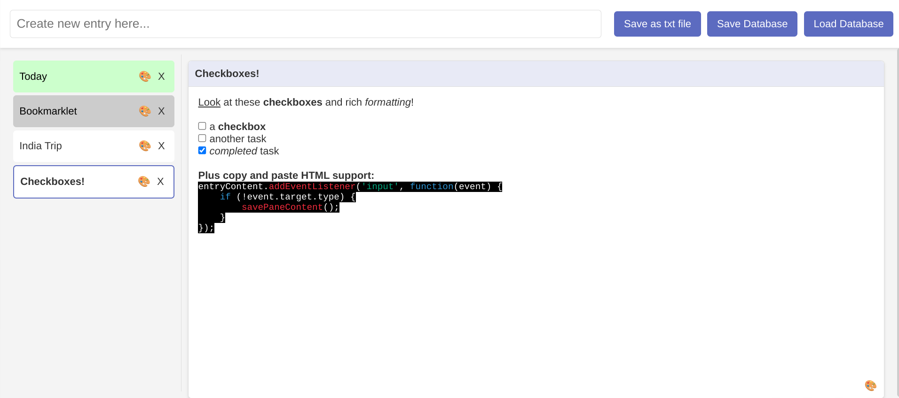

# Note-Taking Bookmarklet

This bookmarklet allows users to take and manage notes directly within a browser, using a simple and intuitive interface. It features note creation and management, note reordering, database saving and loading, checkbox interaction, color customization, and additional utilities for enhanced note-taking experience.

## Features

- **Create and Manage Notes**: Add new notes and manage them in a sidebar.
- **Split Note Pane**: Split notes into multiple panes for side-by-side comparison or multitasking.
- **Reorder Notes**: Drag and drop notes in the list to reorder them.
- **Save and Load Notes**: Save your notes to a hidden textarea, which acts as a database. Load your notes from this database.
- **Checkbox Support**: Add interactive checkboxes within your notes. Type `[]` for an unchecked box, or `[x]` for a checked box.
- **Color Customization**: Set custom colors for note titles and backgrounds.
- **Reordering Split Panes**: Rearrange the order of split note panes.
- **Save as Text File**: Export individual notes as text files.
- **Copy/Paste HTML Support**: Copy and paste HTML content directly into notes.
- **Toggle Sidebar and Top Pane**: Use buttons to hide/show the sidebar and top pane for more focused note-taking.
- **Auto Save Feature**: Automatically saves notes to the hidden textarea database at regular intervals.
- **Help Overlay**: Accessible guide and tips for using the bookmarklet's features.

## Installation

1. Copy [bookmark.html](https://raw.githubusercontent.com/pwillia7/Text_Bookmarklet/main/bookmarklet.html) to your clipboard.
2. Paste the bookmarklet into your address bar. 
3. Save the bookmarklet as a bookmark.
4. Click on the bookmark to open the note-taking interface in your current browser window.

## Usage

### Creating and Editing Notes

1. Enter a note title in the top input bar and press `Enter` to create.
2. Click on a note in the sidebar to open and edit it in the main content area.

### Additional Features

- **Toggle Sidebar/Top Pane**: Click the toggle buttons to collapse or expand the sidebar and top pane.
- **Auto Save**: Notes are automatically saved every 5 minutes or when changes are detected.

### Splitting and Reordering Notes

- Drag a note onto another to split the pane.
- Drag and drop notes or panes to reorder.

### Working with Checkboxes

- Type `[]` for an unchecked box, or `[x]` for a checked box, which will convert to interactive checkboxes.

### Saving and Loading Notes

- Click "Save Database" to save notes to a file.
- Click "Load Database" to load notes from a file.

### Customizing Colors

- Click the color icon (🎨) next to a note to customize its colors.

### Exporting Notes

- Use the "Save as txt file" button to export individual notes as text files.

## Screenshots

### Color Customization

### Split Note Panes

### Checkbox Interaction

## Known Issues

- Checkboxes need a note reload to appear after being entered.
- Due to the bookmarklet's context, web APIs cannot be used, and data is stored in a hidden textarea.

## Contributing

Contributions, issues, and feature requests are welcome. Feel free to check [issues page](https://github.com/pwillia7/Text_Bookmarklet/issues) if you want to contribute.

## License

Distributed under the MIT License. See `LICENSE` for more information.
